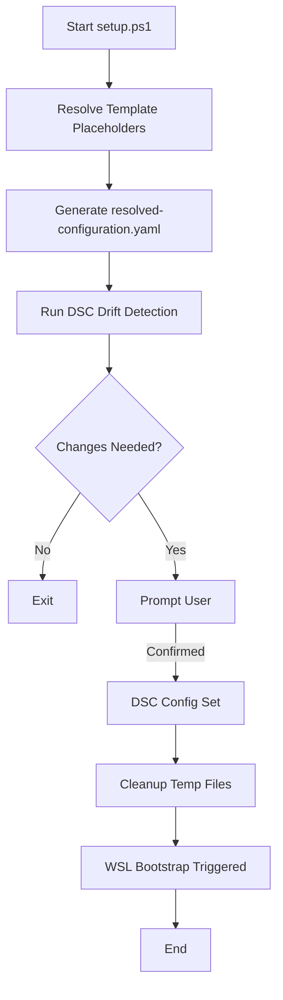

# 🧠 The Bootstrap Guide

Welcome to the comprehensive guide for **pc.bootstrap**. This document details the architecture, workflows, and internal mechanisms that power your automated Windows development environment.

---

## 🏗️ Architecture Overview

The project is built on **Native DSC v3**, a declarative configuration engine that allows you to define your system's state in YAML.

### 🧬 Core Components

| Component                | Responsibility                                                                    |
| :----------------------- | :-------------------------------------------------------------------------------- |
| **`configuration.yaml`** | The "Source of Truth". Defines all packages, settings, and features.              |
| **`setup.ps1`**          | User-facing entry point. Handles prerequisite checks and logic delegation.        |
| **`scripts/`**           | The engine room. Contains the PowerShell and Bash logic for both Windows and WSL. |
| **`configs/`**           | Static configuration files, dotfiles, and templates deployed by DSC.              |

---

## 🔄 Execution Workflow

When you run `.\setup.ps1`, the following sequence occurs:

### 1. Template Resolution

Dynamic paths like `$env:USERPROFILE` and the WSL representation of the repository root are injected into the configuration.

### 2. Drift Detection

The system uses `dsc config test` to compare your current system state against the desired state. It provides a visual report (✅ for in-state, ⚠️ for drift).

### 3. Application

If drift is detected and confirmed, `dsc config set` is invoked to bring the system into compliance.

---

## 🐧 WSL Bootstrap: The Two-Stage Process

To ensure a seamless Linux development environment, the bootstrap uses a two-stage approach:

### Stage 1: The Bootstrapper (`bootstrap-linux.sh`)

Since a fresh WSL distro lacks PowerShell and DSC, this Bash script:

1. Installs **PowerShell** via the Microsoft APT repository.
2. Downloads and installs the **Native DSC v3** binary.
3. Hands over execution to the PowerShell stage.

### Stage 2: The Interior Setup (`Invoke-WslBootstrap.ps1`)

Running inside WSL with PowerShell, this script:

1. Installs core **APT** packages (git, yq, etc.).
2. Installs **Homebrew** and developer tools (bun, uv, opentofu).
3. Configures `/etc/profile.d/` for persistent path configuration.
4. Creates an **onboarding marker** at `/root/.wsl-bootstrapped` to prevent redundant runs.

---

## 🔧 Script Reference

| Script                            | Purpose                     | Key Parameters    |
| :-------------------------------- | :-------------------------- | :---------------- |
| `setup.ps1`                       | Main entry point            | `-Test`, `-Force` |
| `scripts/Invoke-WindowsSetup.ps1` | Windows automation logic    | `-Test`, `-Force` |
| `scripts/Invoke-Lint.ps1`         | Validates YAML syntax       | N/A               |
| `scripts/Install-Dsc.ps1`         | Standalone DSC v3 installer | N/A               |
| `scripts/bootstrap-linux.sh`      | Initial WSL Bash setup      | N/A               |
| `scripts/Invoke-WslBootstrap.ps1` | WSL internal configuration  | `-RepoPath`       |

### 🏷️ Template Placeholders

These tags in `configuration.yaml` are replaced at runtime:

- `{{USER_PROFILE}}`: Expands to `C:\Users\<User>`.
- `{{REPO_ROOT_WSL}}`: Expands to the WSL path (e.g., `/home/...`).

---

## 🛠️ Maintenance & Expansion

### Adding a New Tool

1. Identify the WinGet ID (e.g., `Microsoft.VisualStudioCode`).
2. Add a resource to `configuration.yaml` under the `resources` list.
3. Follow the **Kebab-Case** and **Inside-Out** naming convention (e.g., `vscode-package`).

### Troubleshooting

- **Permission Denied**: Ensure you are running PowerShell as Administrator.
- **WSL Not Starting**: Verify the `VirtualMachinePlatform` and `Microsoft-Windows-Subsystem-Linux` features are enabled (the bootstrap does this, but a reboot may be required).
- **DSC Not Found**: Run `scripts/Install-Dsc.ps1` to manually repair the DSC installation.

---

_Maintained with ❤️ by Antigravity_
